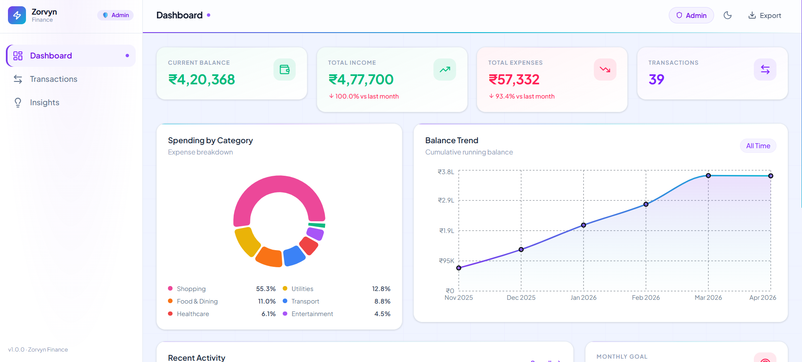
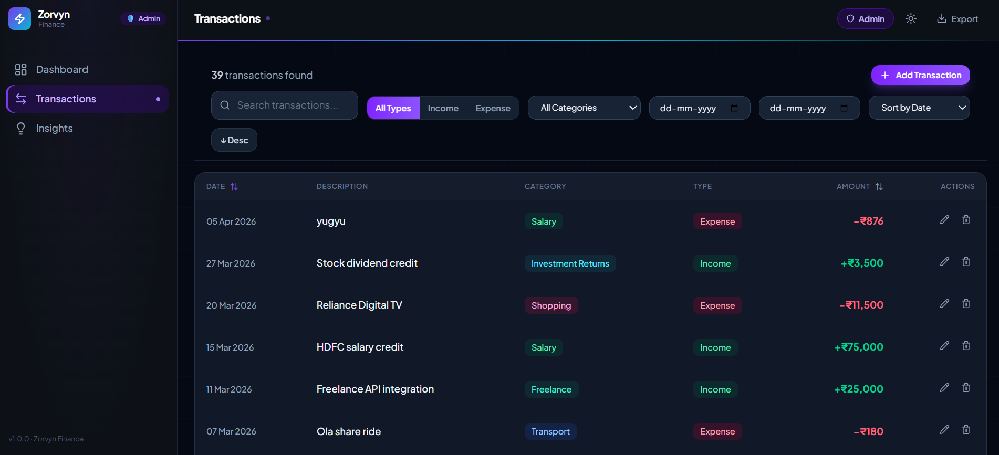
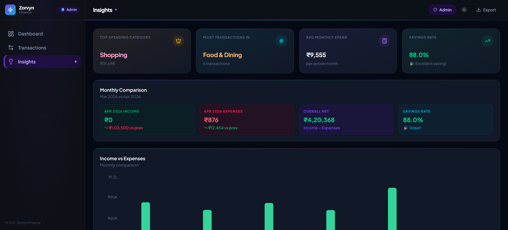
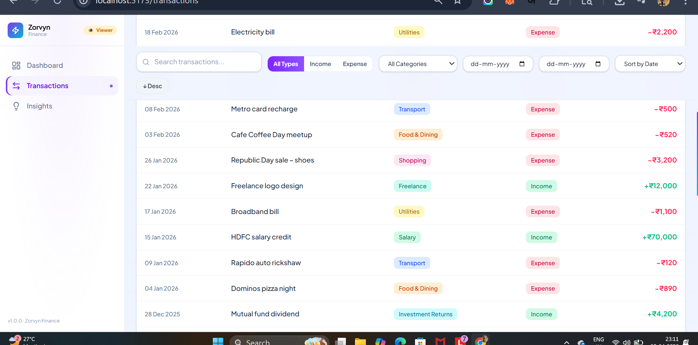

# Zorvyn Finance — Personal Finance Dashboard

> A premium financial dashboard built for the **Zorvyn Frontend Task**. Features a stunning **Midnight Aurora** dark theme, real-time financial insights, role-based UI, GSAP animations, and full data persistence.



---

## 🌌 Theme: Midnight Aurora

| Token | Value |
|-------|-------|
| Primary | Violet `#7c3aed` |
| Accent | Electric Cyan `#06b6d4` |
| Background (Dark) | Deep Navy `#050914` |
| Background (Light) | Soft `#f0f4ff` |
| Income | Neon Mint `#34d399` |
| Expense | Coral Rose `#fb7185` |
| Font | Plus Jakarta Sans |

---

## ✨ Features

### 1. Dashboard Overview
- **4 Summary Cards**: Current Balance, Total Income, Total Expenses, Transaction Count — each with month-over-month delta indicators
- **Balance Trend Chart**: Cumulative area chart with violet→cyan gradient stroke across all months
- **Spending by Category**: Donut chart with custom legend showing top-6 categories
- **Recent Activity**: 5 most recent transactions with category icons
- **Spending Goal Tracker**: Visual progress bar card with color-coded status (green/amber/red)

### 2. Transactions Section
- **Full table view** with Date, Description, Category, Type, Amount columns
- **Filtering**: Keyword search, type toggle (All / Income / Expense), category dropdown, date range picker
- **Sorting**: Click Date or Amount headers to sort ascending/descending
- **Export**: Download visible transactions as CSV

### 3. Role-Based UI
Two roles simulated on the frontend — switch via the pill button in the top navbar:

| Feature | Admin | Viewer |
|---------|-------|--------|
| View all data | ✅ | ✅ |
| Add Transaction | ✅ | ❌ |
| Edit Transaction | ✅ | ❌ |
| Delete Transaction | ✅ | ❌ |
| Read-only banner | — | ✅ |

### 4. Insights Section
- **4 KPI Tiles**: Top spending category, most transactions by category, avg monthly spend, savings rate
- **Monthly Comparison Panel**: Side-by-side current vs previous month income/expenses with deltas
- **Income vs Expenses Bar Chart**: Grouped monthly bars (neon mint + coral rose)
- **Category Breakdown Table**: Full table with category icons, amounts, percentages, and mini progress bars

### 5. State Management
- **Zustand** stores for:
  - `transactionStore` — CRUD operations with **localStorage persistence** (`fin-transactions`)
  - `filterStore` — keyword, kind, category, date range, sort
  - `roleStore` — active role (admin/viewer)
- Custom hook `useDerivedFinancials` computes all metrics in a single memoized pipeline

### 6. Animations (GSAP)
Custom hooks at `src/hooks/useGsapAnimations.ts`:
- **`useStaggerEntrance`** — cards and table rows slide up with staggered 80ms delay
- **`useFadeScaleEntrance`** — charts fade in with a subtle scale effect
- **`useSlideInLeft`** — sidebar nav items cascade in from the left on mount
- **`useCountUp`** — number counter animation for metric values

---

## 🎞️ UI Glimpses

### Dashboard Page
Beautiful summary cards with KPIs, balance trend chart, and spending breakdown by category.


### Transactions Page (Dark Mode)
Full-featured transactions table with advanced filtering, sorting, search, and add/edit capabilities.


### Insights Page
Comprehensive analytics with KPI tiles, monthly comparison panel, and income vs expenses chart.


### Transactions Page (Viewer Mode - Light Theme)
Read-only transaction view with role-based access control and viewer mode badge.


---

## 🛠 Tech Stack

| Layer | Technology |
|-------|-----------|
| Framework | React 19 + Vite |
| Language | TypeScript |
| Styling | TailwindCSS v4 |
| Charts | Recharts |
| Animation | GSAP |
| State | Zustand |
| Routing | React Router v7 |
| Persistence | localStorage (via Zustand persist) |
| Icons | Lucide React |
| Dates | date-fns |

---

## 🚀 Getting Started

```bash
# Install dependencies
npm install

# Start dev server
npm run dev

# Build for production
npm run build
```

---

## 📁 Project Structure

```
src/
├── components/
│   ├── dashboard/       # MetricCards, TrendLineChart, CategoryDonutChart, RecentTransactionsMini, SpendingGoalCard
│   ├── insights/        # InsightTile, IncomeExpenseBarChart, CategoryBreakdownTable
│   ├── layout/          # AppSidebar, TopNavbar, PageShell
│   ├── transactions/    # TransactionList, FilterToolbar, TransactionFormModal
│   └── ui/              # Button, Card, Badge, Modal, TextInput, SelectInput
├── constants/           # categoryConfig (visual config per spending category)
├── data/                # seedTransactions (initial demo data)
├── hooks/               # useDerivedFinancials, useGsapAnimations
├── pages/               # DashboardPage, TransactionsPage, InsightsPage
├── store/               # transactionStore, filterStore, roleStore (Zustand)
├── types/               # finance.ts (TypeScript types)
└── utils/               # aggregations, currency, cn, fileExport
```

---

## 🎨 Design Decisions

- **Dark mode default** — The Midnight Aurora theme looks best in dark mode (F key). Auto-applies on first load.
- **Layout flip** — Unlike the original, the Donut chart is on the **left** and Trend chart on the **right** for visual distinctiveness.
- **Role as toggle** — The role switcher is a pill toggle button instead of a dropdown for a cleaner feel.
- **Gradient scrollbar** — Custom violet→cyan gradient scrollbar throughout.
- **Aurora grid background** — Subtle SVG grid pattern in the page background for depth.

---


